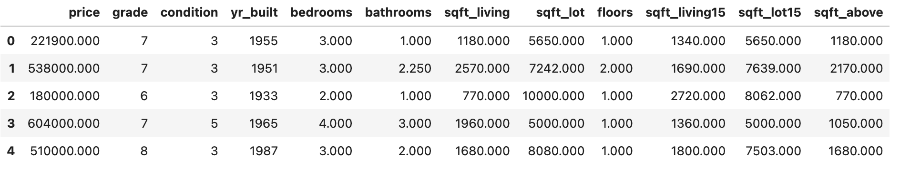
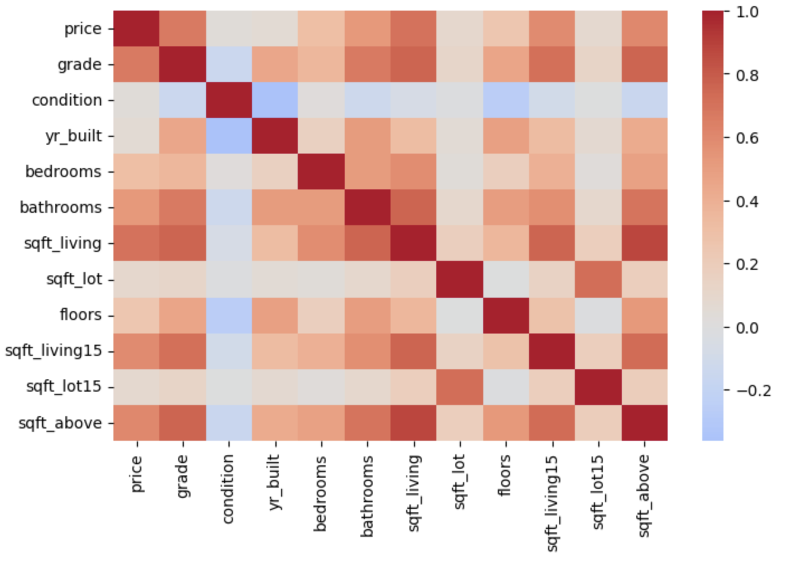
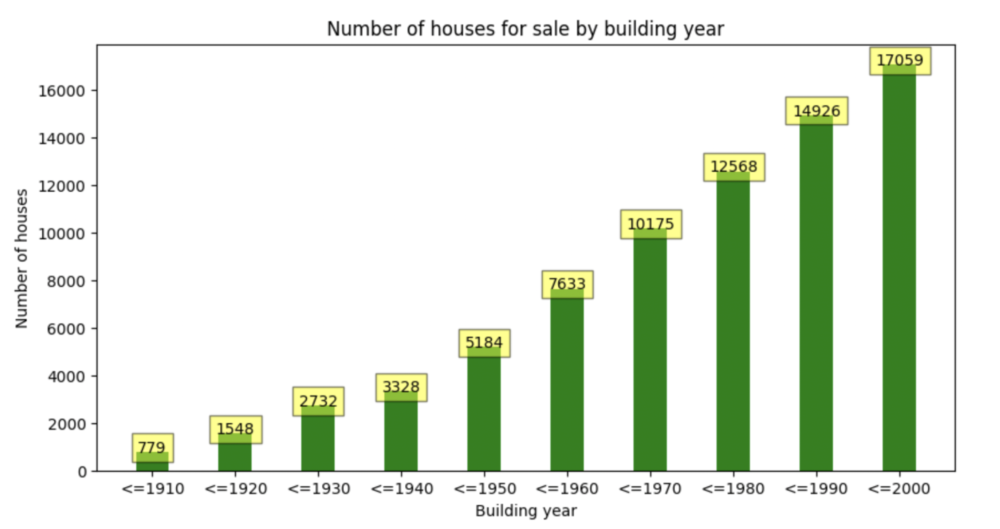
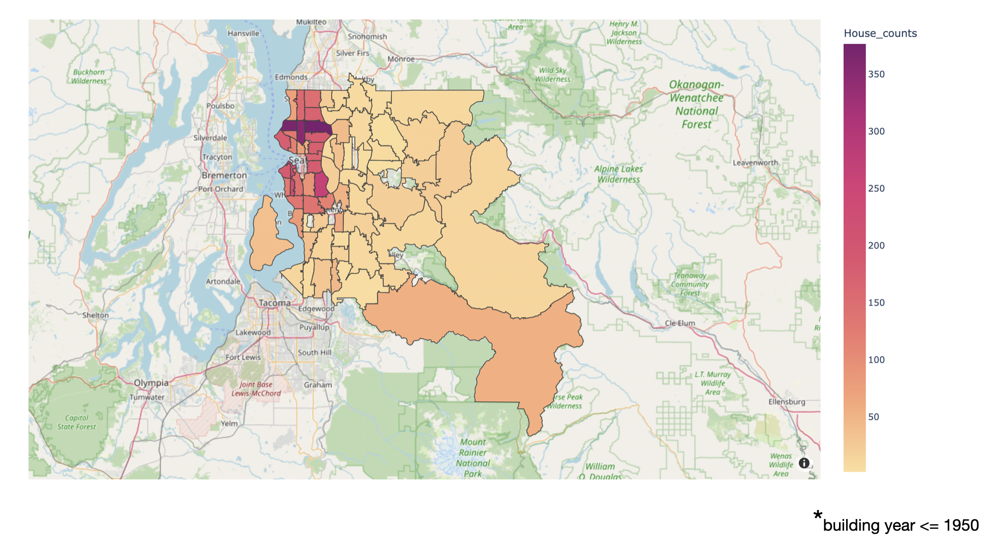
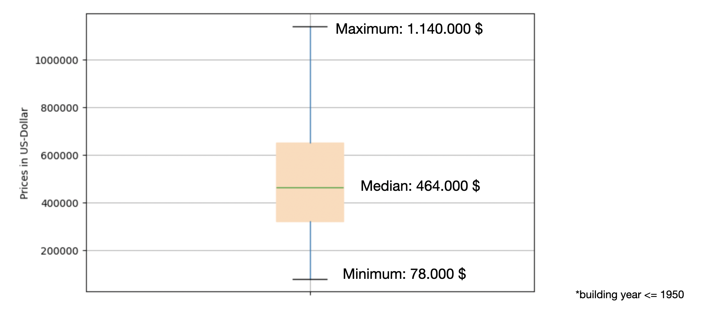
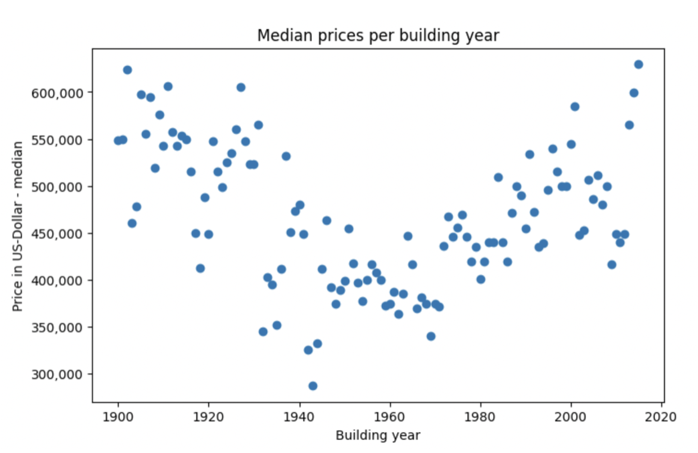
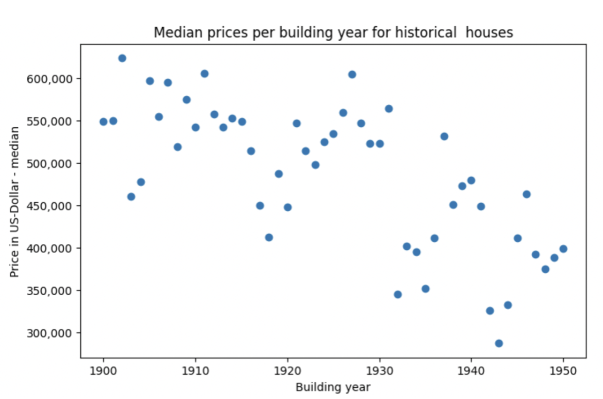

# Small EDA project analyzing house sales data 

## Dataset
https://www.kaggle.com/datasets/harlfoxem/housesalesprediction

## Dataset Summary

- about 21.000 entries (= house descriptions)
- The dataset contains features like house size, number of bathrooms, buidling year, quality of neighborhood, price, etc.

 

 
 

## Interesting insights

### Correlation heatmap

- There are some strong feature correlations, e.g. between price and sqft_living (the bigger the house the higher the house price) or price and sqft_living15 (the better the neighborhood the higher the house price).

 
 

### Real estate market around Seattle in 2014/2015

 
 

### Number of historic* houses for sale per zipcode

 
 

### Price range for historic* houses

 
 

### Median house prices per building year

 
 

### Median house prices for historic houses per building year

